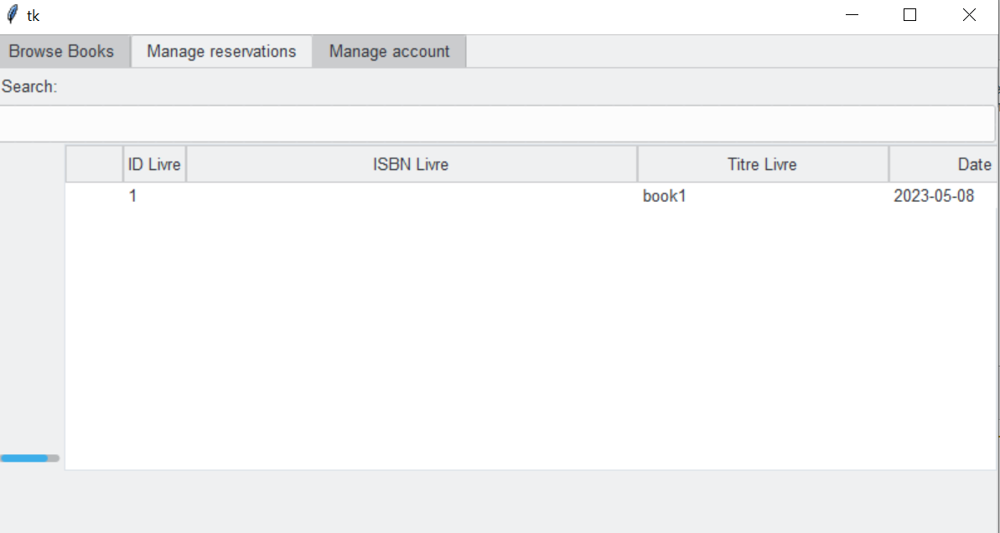

# PFA-BIBLIOTHEQUE
Le projet consiste en une application de gestion de bibliothèque comprenant deux vues: une vue administrateur et une vue adhérent. La vue administrateur permet de gérer les réservations, les emprunts, les livres et les adhérents. La vue adhérent permet de parcourir les livres, de les réserver et de voir l'état de ses emprunts. L'interface graphique de l'application est réalisée en utilisant la bibliothèque Tkinter de Python, tandis que la base de données est gérée par SQLite.

### Tkinter et SQLite, pourquoi? 
Tkinter est une bibliothèque standard de Python pour créer des interfaces graphiques (GUI). Elle est simple à utiliser et offre de nombreuses fonctionnalités pour créer des applications de bureau avec des interfaces graphiques interactives. Elle est également compatible avec la plupart des systèmes d'exploitation et des plates-formes, ce qui la rend très flexible et facile à déployer.

SQLite est une base de données relationnelle légère qui est souvent utilisée pour des applications de bureau. Elle est facile à utiliser et ne nécessite pas de configuration de serveur, ce qui la rend très pratique pour des projets de petite envergure. SQLite est également très rapide et peut gérer de grandes quantités de données. Elle est compatible avec la plupart des langages de programmation, y compris Python.

C'est pourquoi, pour le projet de gestion de bibliothèque, nous avons choisi d'utiliser Tkinter pour la création de l'interface utilisateur et SQLite pour stocker les données de la bibliothèque.

## Sommaire :
- Partie Conception
- Installation
- Fonctionalités et utilisation
- Contributeurs

## Partie Conception

## Fonctionalités et utilisation :
L'application de gestion de bibliothèque offre les fonctionnalités suivantes :

# Fonctionalités: 
### Authentfication et enregistrement:
- S'authetifier : Se connecter à son compte à travers ses identifiants uniques
 
- Créer un compte : Les adhérents de la bibliothèque peuvent se créer des comptes

- Le nom d'utilisateur et le mot de passe se chaque adhérent sont générés de façon automatique. Une fiche apparait après l'enregistrement pour que l'adgérent puisse noter ses identifiants. Il a aussi la possibilité de les modifier ou de supprimer son compte

 
### Vue administrateur :
 
* Gérer les adhérents : Ajouter, supprimer, modifier et parcourir les informations des adhérents
 + Ajouter des adhérents :
 
 +Parcourir les adhérents :
 
 +Chercher des clients particuliers:
     Exemple: recherche clients avec "user" dans leur nom
     
  +Selectionner un client particulier afin d'afficher toutes ses informations (les identifiant et mots de passe ne sont pas affichés sinon pour des raisons de confidentialité), les modifier ou supprimer son compte
  
  
* Gérer les livres : Ajouter, supprimer, modifier, rechercher et parcourir les livres de la bibliothèque
 + Ajouter un livre:
 
 +Parcourir les livres de la bibliothèque:
 
 + Rechercher un livre en particulier. En plus de la fonction de recherche basique, il est possible d'afficher plus d'options de recherche(par auteur, année, etc...) en appyuant sur le bouton "more options"
    Exemple: recherche livre avec nom d'auteur "author2"
    
 + Selectionner un livre afin d'afficher toutes les informations le concernant, les modifier ou supprimer le livre:
 
 
* Gérer les emprunts et retours: 
  + Parcourir les emprunts et voir s'ils sont en retard ou pas
  
  + Enregistrer un nouvel emprunt à travers les ids respectifs du client et du livre concernés
  
  +  Retourner un livre emprunté à partir des memes ids
  
  
 * Modifier son identifiant et mot de passe et se déconnecter
  

### Vue adhérent :

- Parcourir les livres disponibles : 
   + Parcourir les livres de la bibliothèque et voir s'ils sont à emprunter ou à consulter sur place
   
   + Rechercher un livre par titre, auteur, année, etc...
   
   +Selectionner un livre en particulier pour voir ses informations et éventuellement le réserver s'il n'est pas déja reservé
   

- Consulter l'état de ses emprunts : 
   Voir les livres empruntés par soi et vérifier si on est en retard ou pas
   
 
 - Modifier les informations relatives à son compte, se déconnecter ou supprimer son compte
  

L'application de gestion de bibliothèque est conçue pour offrir une expérience utilisateur facile et intuitive, avec une interface utilisateur claire et conviviale. Les fonctionnalités sont conçues pour répondre aux besoins à la fois des administrateurs de bibliothèques et des adhérents.

## Utilisation : 
 Pour utiliser l'application, veuillez mettre les fichiers .py contenus dans ce repository dans le meme emplacement et excecuter le fichier "login.py"

